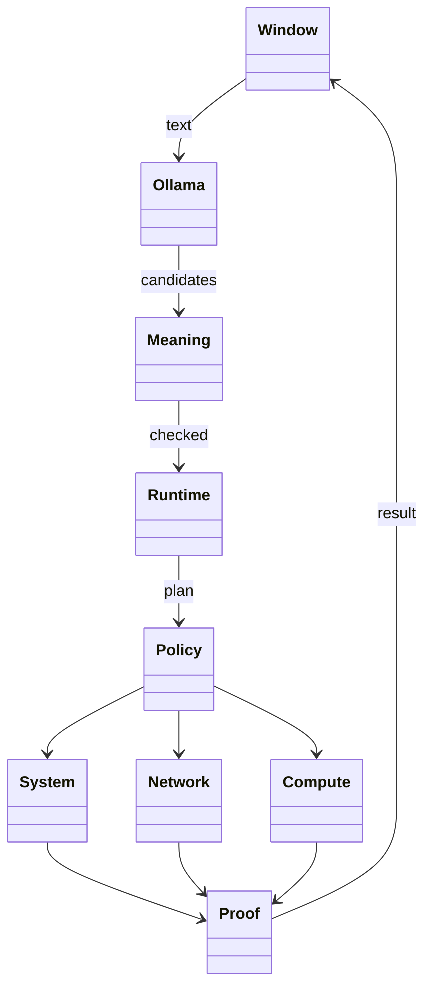
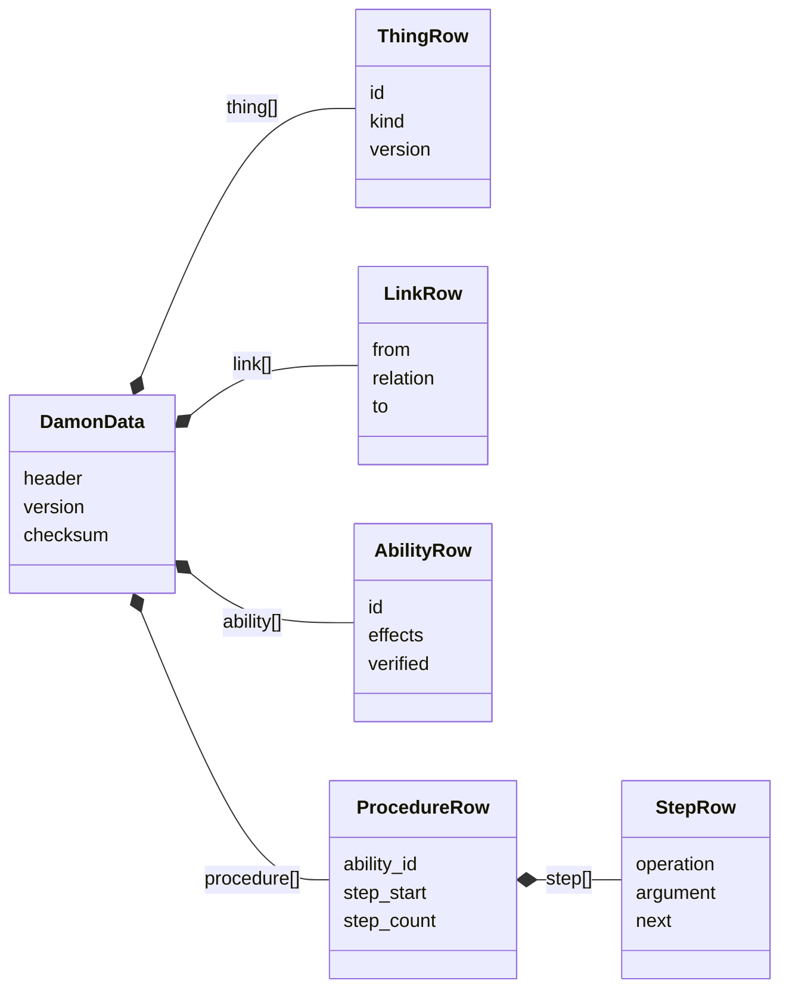
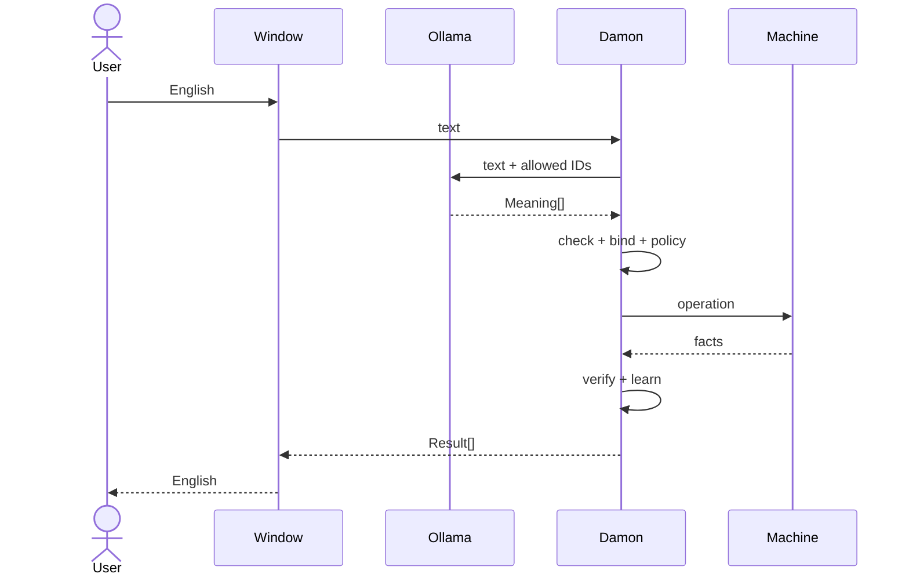
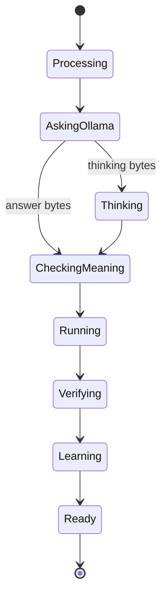

# Damon core structures

```mermaid
classDiagram
direction TB
class Window
class Ollama
class Meaning
class Runtime
class Policy
class System
class Network
class Compute
class Proof
Window --> Ollama : text
Ollama --> Meaning : candidates
Meaning --> Runtime : checked
Runtime --> Policy : plan
Policy --> System
Policy --> Network
Policy --> Compute
System --> Proof
Network --> Proof
Compute --> Proof
Proof --> Window : result
```

```mermaid
classDiagram
direction LR
class DamonData {
  header
  version
  checksum
}
class ThingRow {
  id
  kind
  version
}
class LinkRow {
  from
  relation
  to
}
class AbilityRow {
  id
  effects
  verified
}
class ProcedureRow {
  ability_id
  step_start
  step_count
}
class StepRow {
  operation
  argument
  next
}
DamonData *-- ThingRow : thing[]
DamonData *-- LinkRow : link[]
DamonData *-- AbilityRow : ability[]
DamonData *-- ProcedureRow : procedure[]
ProcedureRow *-- StepRow : step[]
```

```mermaid
sequenceDiagram
actor User
participant Window
participant Ollama
participant Damon
participant Machine
User->>Window: English
Window->>Damon: text
Damon->>Ollama: text + allowed IDs
Ollama-->>Damon: Meaning[]
Damon->>Damon: check + bind + policy
Damon->>Machine: operation
Machine-->>Damon: facts
Damon->>Damon: verify + learn
Damon-->>Window: Result[]
Window-->>User: English
```

```mermaid
stateDiagram-v2
[*] --> Processing
Processing --> AskingOllama
AskingOllama --> Thinking: thinking bytes
AskingOllama --> CheckingMeaning: answer bytes
Thinking --> CheckingMeaning
CheckingMeaning --> Running
Running --> Verifying
Verifying --> Learning
Learning --> Ready
Ready --> [*]
```

The Rust core uses only the standard library. SwiftUI draws the macOS window.
