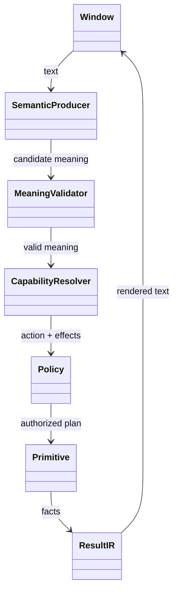
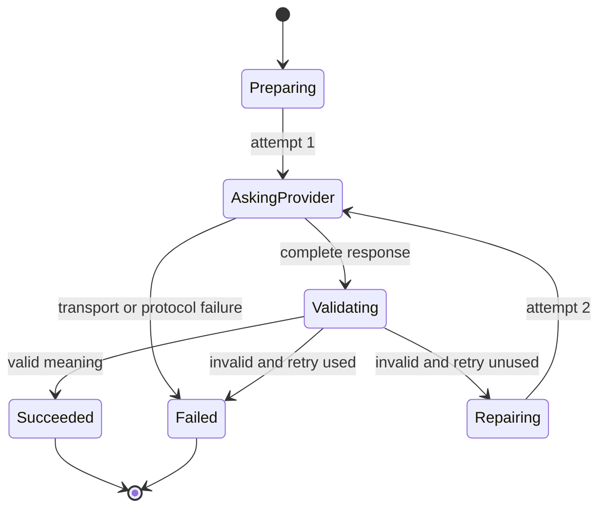
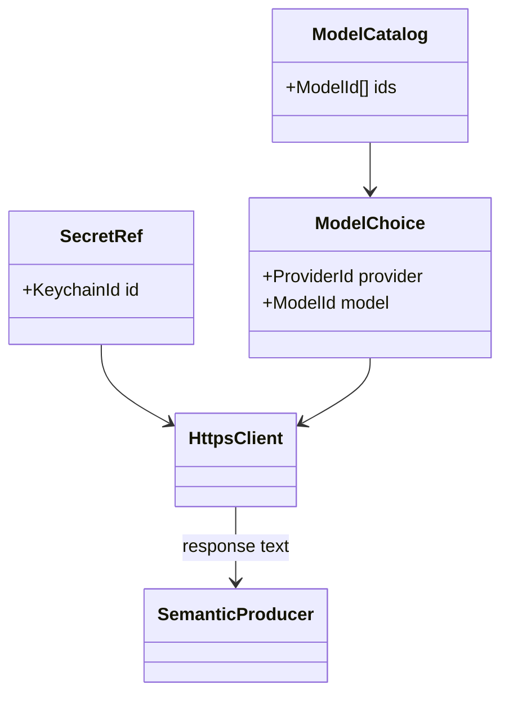
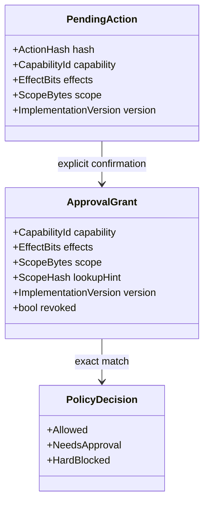
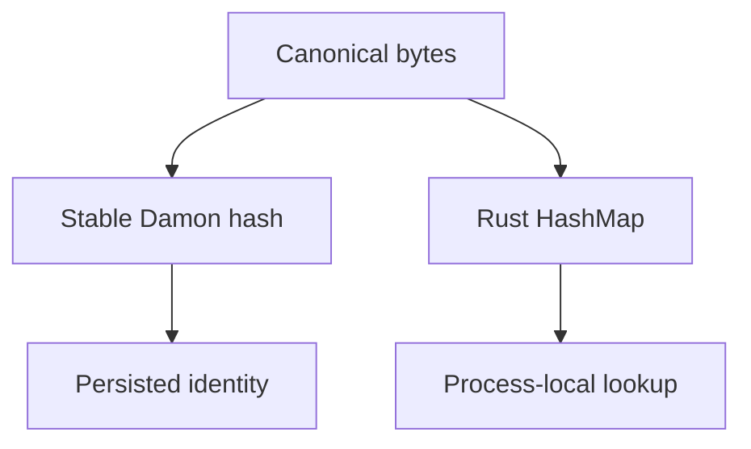
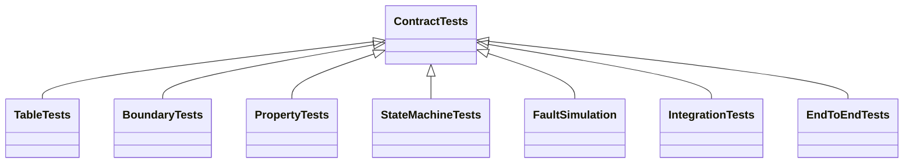

# Provider, policy, and test design

Status: implemented contract and regression-test map.

## Runtime boundary

The model produces meaning only. Provider choice, commands, network protocols,
policy, execution, verification, and result wording remain Damon decisions.

## Model request state machine

Invariants:

1. `attempt` starts at zero and only increases.
2. `attempt <= 2` for one semantic request.
3. No transition points to an earlier attempt.
4. A provider response is consumed once.
5. A terminal protocol marker ends parsing; trailing bytes cannot restart it.
6. Every exit emits exactly one terminal state: success or failure.
7. Timeouts bound blocked I/O, but transition count proves loop termination.
8. Provider output is untrusted until structural and semantic validation pass.

Ollama remains available as an explicitly configured fallback, but its default
model is empty. OpenCode Zen is the first cloud teacher. Damon calls Zen's HTTPS
API directly rather than automating the OpenCode application.

## Zen v1 slice

Initial support is deliberately narrow:

- Fetch `/zen/v1/models` and expose currently advertised free models using the
  OpenAI-compatible chat-completions endpoint.
- Keep the chosen model as ordinary configuration.
- Keep the API key in macOS Keychain; never write it to `damon.data`, logs,
  command-line arguments, or chat history.
- Use `ureq` with `rustls` for HTTP/TLS framing and certificate verification.
- Keep Damon's bounded JSON parser for the small request/response structures.
- Add Anthropic Messages, OpenAI Responses, and Gemini protocols only through
  separate tested adapters; do not guess one protocol from a model name.

## Remembered authorization

Invariants:

1. A denial names the missing effect and exact scope in plain language.
2. “Do it” can approve only the currently pending action hash.
3. The grant matches capability, effects, canonical scope bytes, and implementation
   version. The stable hash is only a lookup hint; equality never trusts it alone.
   A wider scope or stronger effect requires a new approval.
4. A matching, non-revoked grant prevents Damon policy from asking twice.
5. Grants are user-controlled metadata, not secrets, and can be revoked.
6. Model output cannot create a grant.
7. OS permissions, unavailable credentials, and hard integrity checks are facts,
   not Damon policy denials; they remain enforceable and are explained.

## Hash rules

- Rust `HashMap` and its standard hash builder are used for process-local index
  lookup and denial-of-service resistance.
- Persisted identifiers use an explicitly versioned stable hash over canonical
  bytes. `DefaultHasher` is never a file-format or cross-version contract.
- A hash match is confirmed against canonical bytes wherever a collision would
  change behavior.

## Test structure

| Test form | Fast fixture | Contract |
|---|---|---|
| Unit/table | in-memory values | exact input/output and errors |
| Boundary | 0, 1, maximum, maximum + 1 | every bound rejects safely |
| Equivalence partition | representative valid/invalid classes | same class, same rule |
| Property | deterministic generated values | round trips and invariants |
| Metamorphic | transformed equivalent inputs | meaning/result stays equivalent |
| State-machine | all legal event sequences | no cycles; at most two calls |
| Model-based | small reference implementation | optimized result matches reference |
| Fault injection | seeded failure schedule | no hang, leak, duplicate execution |
| Serialization | golden bytes + round trip | stable bytes and version rejection |
| Compatibility | recorded provider fixtures | protocol shape remains supported |
| Integration | loopback TCP/UDP/HTTP | real kernel I/O, no public internet |
| End-to-end | child process + temp data | UI protocol through verified result |
| Fuzz corpus | checked-in malformed bytes | every prior crash stays fixed |
| Concurrency | enumerated interleavings | one terminal result, no double action |
| Performance | fixed operation budget | hot paths remain bounded and small |
| Mutation audit | occasional local/CI job | tests detect deliberate defects |

Tests are changed only when the product contract intentionally changes. A code
failure against an unchanged contract is a code defect. Public internet and live
model services are excluded from normal CI; recorded fixtures and deterministic
loopback servers simulate success, truncation, delay, malformed data, status
errors, duplicate terminal markers, and connection loss.

## Algorithm choices

| Need | Initial structure | Upgrade trigger |
|---|---|---|
| Runtime lookup | Rust `HashMap` | measured collision/memory issue |
| Persistent lookup | sorted array + binary search | measured rewrite cost |
| Allowed concepts/effects | integer bit set | registry exceeds bit capacity |
| Meaning order | topological sort | none; cycles stay illegal |
| Best few candidates | bounded sorted array | large candidate count, then heap |
| Route choice | longest-prefix scan | large route table, then prefix tree |
| Network groups | graph walk | snapshot grouping needs disjoint sets |
| Phrase matching | direct rules | hundreds of phrases, then multi-pattern automaton |
| Reused subproblem | memo table | only with measured overlap |
| Simulation | seeded event queue | retain deterministic replay forever |

Competitive-programming structures are candidates, not goals. Coordinate
compression, prefix offsets, binary search, bit sets, topological sorting,
bounded heaps, disjoint sets, and prefix trees enter only when their invariant
matches a measured Damon problem.

## Sources informing the design

- Kent Beck, *Test-Driven Development: By Example*:
  <https://www.pearson.com/en-us/subject-catalog/p/test-driven-development-by-example/P200000009421/9780321146533>
- James Grenning, *Test-Driven Development for Embedded C*:
  <https://pragprog.com/titles/jgade/test-driven-development-for-embedded-c/>
- Freeman and Pryce, *Growing Object-Oriented Software, Guided by Tests*:
  <https://growing-object-oriented-software.com/>
- Steven Skiena, *The Algorithm Design Manual*:
  <https://link.springer.com/book/10.1007/978-3-030-54256-6>
- Open Data Structures: <https://opendatastructures.org/>
- redb design and recovery: <https://github.com/cberner/redb>
- TigerBeetle assertions and deterministic simulation:
  <https://github.com/tigerbeetle/tigerbeetle>
- ripgrep bounded, measured systems design:
  <https://github.com/BurntSushi/ripgrep>
- rustls and ureq protocol boundaries: <https://github.com/rustls/rustls> and
  <https://github.com/algesten/ureq>
- Rust testing tools and techniques: <https://github.com/proptest-rs/proptest>,
  <https://github.com/tokio-rs/loom>, <https://github.com/model-checking/kani>,
  and <https://github.com/nextest-rs/nextest>
- Competitive Programming Algorithms and KACTL:
  <https://github.com/cp-algorithms/cp-algorithms> and
  <https://github.com/kth-competitive-programming/kactl>
- OpenCode Zen endpoints, current free models, pricing, and privacy:
  <https://opencode.ai/docs/zen/>
